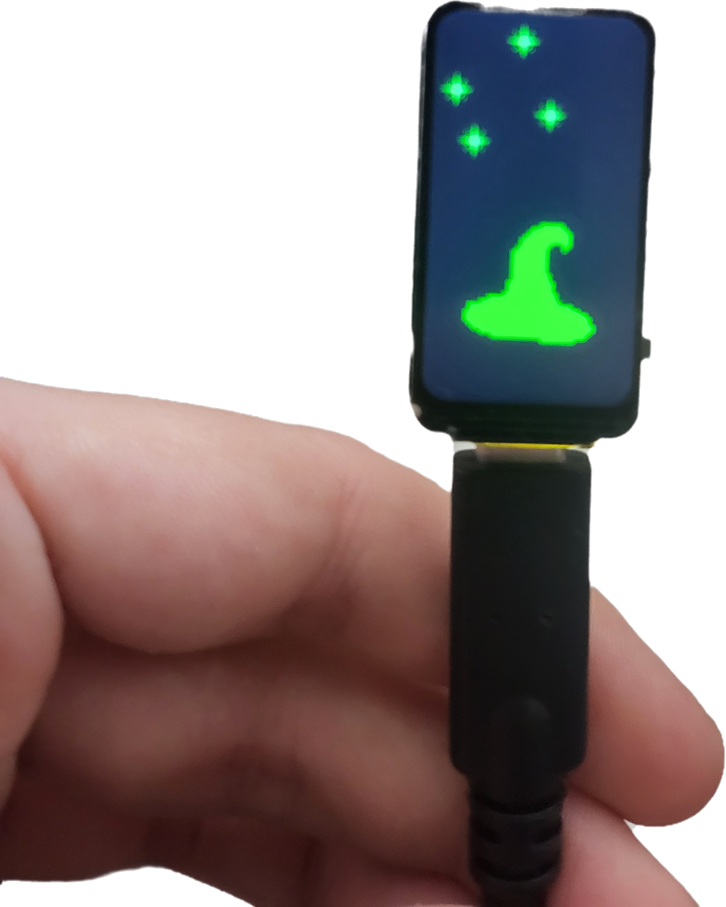

An RSSI BLE based distance sensor, with some fancy ass hacker graphics, fucking based. 
(do not use this, the code is bad, i dont like lvgl)


buy a and then flash with Arduino IDE 
```
ESP32-C6-LCD-1.47
```
link: https://www.electrokit.com/en/utvecklingskort-med-esp32-c6-och-microlcd-172x320px

